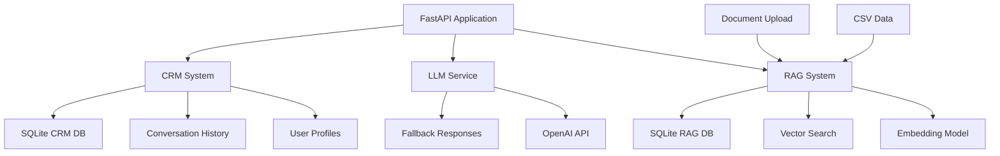

# Multi-Agentic Conversational AI System

A Python-based RESTful API application that enables natural language conversation with a Large Language Model (LLM), integrated with Retrieval Augmented Generation (RAG) and a custom-built CRM system.

## 🚀 Features

- **Conversational AI**: Natural language processing with OpenAI GPT integration
- **RAG System**: Retrieval-Augmented Generation with semantic search capabilities
- **CRM Integration**: User profile management and conversation history tracking
- **Real Estate Focus**: Specialized for property listings and real estate inquiries
- **RESTful API**: Complete API with all required endpoints
- **Data Ingestion**: Support for CSV, JSON, TXT, and PDF files
- **Conversation Memory**: Full conversation history with contextual awareness
- **User Categorization**: Automatic conversation tagging and status tracking
  
## Screenshots


## 📋 Requirements

- Python 3.8+
- OpenAI API key (Recommended - system works with fallback responses)
- 4GB+ RAM (for embedding model)

## 🛠️ Installation

1. **Clone the repository**
```bash
git clone <repository-url>
cd multi-agentic-ai-system
```

2. **Create virtual environment**
```bash
python -m venv venv
source venv/bin/activate  # On Windows: venv\Scripts\activate
```

3. **Install dependencies**
```bash
pip install -r requirements.txt
There are many libraries installed during the coding process, forgot to add them in the requirements.txt, please add them manually if you encountered any issue
```

4. **Set up environment variables**
```bash
cp .env.template .env
# Edit .env file with your OpenAI API key
```

5. **Initialize the system**
```bash
python3 main.py
```

The system will automatically:
- Initialize SQLite databases
- Load the embedding model
- Process the initial CSV data if available
- Start the FastAPI server on http://localhost:8000
- opens 2 browser windows, one for chatbot and another for broker dashboard, wait for the main server to load if you see site can't be reached and refresh those pages
- Chatbot is meant for agent chat and broker dashboard is to see the info and access chat history
### CSV Format Expected:
- unique_id
- Property Address
- Floor
- Suite
- Size (SF)
- Rent/SF/Year
- Associate 1
- BROKER Email ID
- Associate 2, 3, 4
- Annual Rent
- Monthly Rent
- GCI On 3 Years

## 🔌 API Endpoints

### Core Endpoints

#### 1. Chat Endpoint
```http
POST /chat
Content-Type: application/json

{
    "message": "I'm looking for a 2000 sq ft office space in downtown",
    "user_id": "optional-user-id"
}
```

**Response:**
```json
{
    "response": "I found several office spaces that match your criteria...",
    "user_id": "generated-or-provided-user-id",
    "conversation_id": "conv_12345_67890",
    "metadata": {
        "response_time": 1.23,
        "rag_sources": 3,
        "user_info_extracted": true
    }
}
```

#### 2. Document Upload
```http
POST /upload_docs
Content-Type: multipart/form-data

files: [file1.csv, file2.txt, file3.json]
```

#### 3. CRM Operations

**Create User:**
```http
POST /crm/create_user
Content-Type: application/json

{
    "name": "John Doe",
    "email": "john@company.com",
    "company": "Tech Corp",
    "phone": "+1234567890"
}
```

**Update User:**
```http
PUT /crm/update_user/{user_id}
Content-Type: application/json

{
    "company": "New Company Name",
    "preferences": {"preferred_size": 3000}
}
```

**Get Conversations:**
```http
GET /crm/conversations/{user_id}
```

#### 4. System Management

**Reset Conversations:**
```http
POST /reset
Content-Type: application/json

{
    "user_id": "optional-specific-user"
}
```

**Health Check:**
```http
GET /health
```

## 🏗️ Architecture

### System Components



### Database Schema

#### CRM Database (`crm_database.db`)

**users**
- user_id (TEXT PRIMARY KEY)
- name, email, company, phone (TEXT)
- preferences, tags (JSON TEXT)
- created_at, updated_at (TIMESTAMP)

**conversations**
- conversation_id (TEXT PRIMARY KEY)
- user_id (TEXT FK)
- status, category (TEXT)
- created_at, updated_at (TIMESTAMP)

**messages**
- message_id (TEXT PRIMARY KEY)
- conversation_id, user_id (TEXT FK)
- user_message, bot_response (TEXT)
- rag_context, metadata (JSON TEXT)
- timestamp (TIMESTAMP)

#### RAG Database (`rag_database.db`)

**documents**
- doc_id (TEXT PRIMARY KEY)
- content (TEXT)
- metadata (JSON TEXT)
- embeddings (BLOB)
- source_file, doc_type (TEXT)
- created_at (TIMESTAMP)

**property_listings**
- unique_id (INTEGER PRIMARY KEY)
- property_address, floor, suite (TEXT)
- size_sf (INTEGER)
- rent_sf_year, annual_rent, monthly_rent (TEXT)
- associate_1, broker_email, etc. (TEXT)
- embeddings (BLOB)
- created_at (TIMESTAMP)

## 🤖 AI Capabilities

### LLM Integration
- **OpenAI GPT**: Primary LLM for response generation
- **Fallback System**: Keyword-based responses when API unavailable
- **Context Awareness**: Uses conversation history and user profile
- **Information Extraction**: Automatically extracts user details

### RAG System
- **Semantic Search**: Uses sentence-transformers for embeddings
- **Hybrid Search**: Combines semantic and keyword search
- **Real Estate Focus**: Specialized property search capabilities
- **Multi-format Support**: CSV, JSON, TXT, PDF processing

### CRM Features
- **Auto-categorization**: Conversations tagged by topic
- **Status Tracking**: Resolved/Unresolved/Inquiring/Follow-up
- **User Profiling**: Automatic extraction of user information
- **Conversation Memory**: Full history with metadata

## 🧪 Testing

### Quick Test
```bash
# Start the server
python main.py

# Test health endpoint
curl http://localhost:8000/health

# Test chat endpoint
curl -X POST http://localhost:8000/chat \
  -H "Content-Type: application/json" \
  -d '{"message": "Hello, I need help finding office space"}'
```

### API Documentation
Visit http://localhost:8000/docs for interactive API documentation.

## 🚀 Advanced Features

### Calendar Integration (Optional)
The CRM system includes optional calendar event management:

```python
# Create calendar event
await crm.create_calendar_event(
    user_id="user123",
    title="Property Viewing",
    start_time=datetime.now(),
    end_time=datetime.now() + timedelta(hours=1),
    description="Office space viewing at downtown location"
)
```

### Custom Categorization
The system automatically categorizes conversations:
- **real_estate**: Property-related inquiries
- **support**: Help and technical issues
- **sales**: Purchase and pricing discussions
- **general**: General inquiries

### Response Personalization
Responses are personalized based on:
- User profile information
- Conversation history
- Extracted preferences
- Previous interactions

## 📈 Performance Optimization

### Embedding Caching
- Embeddings are cached in database
- Reduces computation for repeated queries
- Supports offline operation

### Database Indexing
- Optimized indexes for fast retrieval
- Efficient conversation history queries
- Scalable design for large datasets

### Memory Management
- Conversation history limited to recent messages
- Efficient vector similarity computation
- Garbage collection for embedding model

## 🔧 Configuration

### Environment Variables
All configuration through `.env` file:
- API keys and credentials
- Model selection and parameters
- Database paths and settings
- Server configuration

### Model Selection
- Default: `all-MiniLM-L6-v2` for embeddings
- Configurable through environment
- Supports any sentence-transformers model

## 📝 API Contracts

### Request/Response Formats

All endpoints return structured JSON responses with consistent format:

```json
{
    "data": {},
    "message": "Operation successful",
    "status": "success",
    "timestamp": "2024-01-01T12:00:00Z"
}
```

Error responses:
```json
{
    "detail": "Error description",
    "status": "error",
    "timestamp": "2024-01-01T12:00:00Z"
}
```

## 🐛 Troubleshooting

### Common Issues

1. **Embedding Model Loading**: 
   - Requires internet connection on first run
   - Downloads ~80MB model file
   - Fallback to keyword search if fails

2. **OpenAI API Errors**:
   - Check API key in .env file
   - Verify API quota and billing
   - System works with fallback responses

3. **Database Permissions**:
   - Ensure write permissions in project directory
   - SQLite files created automatically

4. **Memory Issues**:
   - Embedding model requires 4GB+ RAM
   - Reduce batch size for large datasets

### Logs
Check console output for detailed error messages and system status.

## 🤝 Contributing

1. Fork the repository
2. Create feature branch
3. Add tests for new functionality
4. Submit pull request

## 📄 License

This project is created for the hackathon submission. Please check with the organizers for licensing terms.

---

**Built with ❤️ for the Multi-Agentic AI Hackathon**
